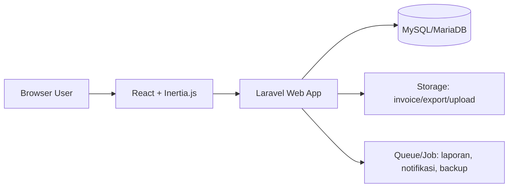
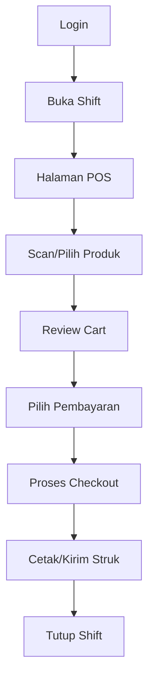
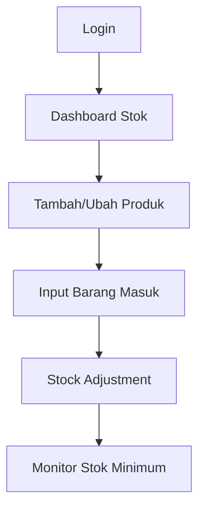
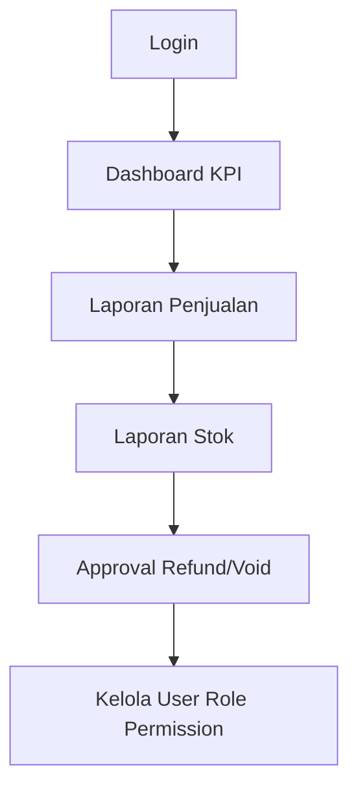

# Arsitektur Aplikasi POS Toko Sepeda (Laravel + Inertia.js + React + Tailwind + MySQL/MariaDB + Zustand)

## 1. Arsitektur Tingkat Tinggi

## 2. Struktur Layer
1. **Presentation Layer**
   - React (Inertia pages), Tailwind CSS, komponen UI.
   - Zustand untuk state client: cart POS, filter produk, UI state, draft transaksi.

2. **Application Layer (Laravel)**
   - Controller Inertia.
   - Service/Action untuk logic bisnis POS.
   - Policy + Gate + Middleware untuk RBAC.

3. **Domain Layer**
   - Entitas utama: User, Role, Permission, Product, Category, StockMovement, Sale, SaleItem, Payment, Customer, Supplier, Purchase, Shift, CashDrawer, Report.

4. **Data Layer**
   - Eloquent Model + Repository (opsional).
   - MySQL/MariaDB (relational + transaction-safe).

---

## 3. RBAC (Role Based Access Control)

## Role Utama
- **Owner/Admin**: full access.
- **Kasir**: transaksi penjualan, buka/tutup shift, lihat stok terbatas.
- **Inventory Staff**: kelola produk, stok masuk/keluar, supplier, pembelian.
- **Manager**: monitoring laporan, approval diskon/void/refund.

## Permission Contoh
- `sales.create`, `sales.refund`, `sales.void`
- `products.read`, `products.create`, `products.update`, `products.delete`
- `stock.adjust`, `purchase.manage`
- `reports.view`, `reports.export`
- `users.manage`, `roles.manage`

## Implementasi Laravel
- Gunakan package **spatie/laravel-permission**.
- Middleware route: `auth`, `role`, `permission`.
- Policy per resource untuk ownership/constraint toko.
- Audit log untuk aksi sensitif: void/refund/edit stok/hapus data.

---

## 4. Workflow Sistem (Teknis)

1. User login.
2. Laravel autentikasi + load role/permission.
3. Inertia kirim props global: user, role, permission map, store profile.
4. React render menu berdasarkan permission.
5. User aksi (mis. tambah item ke cart) disimpan di Zustand.
6. Checkout kirim payload ke endpoint Laravel.
7. Laravel validasi, lock stock, simpan `sale + sale_items + payment` dalam DB transaction.
8. Update stok via stock movement.
9. Response sukses ke Inertia, tampil invoice + opsi cetak.
10. Semua aksi penting tercatat di audit log.

---

## 5. Workflow Bisnis POS Toko Sepeda

1. **Setup awal**
   - Admin set role, user, kategori, produk, harga, pajak, metode pembayaran.

2. **Operasional harian**
   - Kasir buka shift + saldo awal kas.
   - Kasir input produk (barcode/manual), atur qty/diskon sesuai hak akses.
   - Sistem hitung subtotal, pajak, total otomatis.
   - Kasir pilih metode bayar (cash/transfer/qris/debit).
   - Transaksi tersimpan, stok berkurang, struk tercetak.

3. **Manajemen stok**
   - Staff inventory input pembelian/produk masuk.
   - Penyesuaian stok (adjustment) wajib alasan + log.
   - Notifikasi stok minimum untuk ban, velg, chain, brake set, dll.

4. **Akhir hari**
   - Kasir tutup shift, rekonsiliasi kas.
   - Manager/Owner review laporan penjualan, profit, produk terlaris.

---

## 6. User Flow per Role

## A. Kasir (Penjualan)

## B. Inventory Staff

## C. Owner/Manager

---

## 7. Rekomendasi Struktur Modul (Folder)

- `app/Actions/POS/*`
- `app/Http/Controllers/*`
- `app/Policies/*`
- `app/Models/*`
- `resources/js/Pages/*`
- `resources/js/Components/*`
- `resources/js/stores/*` (Zustand)
- `routes/web.php`
- `database/migrations/*`

---

Kalau Anda mau, saya bisa lanjutkan dengan **blueprint database (ERD + tabel detail + relasi + index)** dan **daftar endpoint API/Web route** yang siap dipakai untuk implementasi sprint pertama.